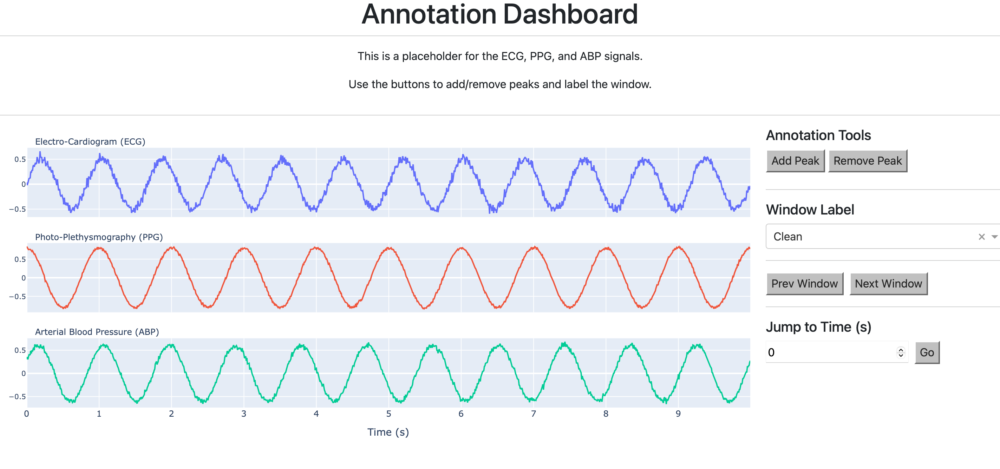

# Current Work:




# Instructions:


```
# cd into django project
cd  analysis_dashboard 
```


``` 
#1. From the folder containing environment.yml:
conda env create -f environment.yml 
```
```
python manage.py migrate
python manage.py runserver

```


# Proposed Universal Schema

```
fix: {
    subj_id
    rec_id
    files
    af_status
    subject_notes
},
ppg: {
    v
    fs
    method
    label
},
ekg: {
    v
    fs
    method
    label
},
bp: {
    v
    fs
    method
    label
    }
```